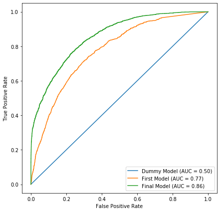

# Mod 3 Code Challenge Review

Today we'll be using the ["Census Income" dataset from the UCI Machine Learning Repository](https://archive.ics.uci.edu/ml/datasets/Adult)

The task is to predict the `income_level` attribute of a given person, which is either `>50K` or `<=50K`

The metric to optimize for is [`roc_auc_score`](https://scikit-learn.org/stable/modules/generated/sklearn.metrics.roc_auc_score.html#sklearn.metrics.roc_auc_score)


```python
import pandas as pd
```


```python
df = pd.read_csv("data/census_income.csv")
```


```python
df.head()
```


<div>
<style scoped>
    .dataframe tbody tr th:only-of-type {
        vertical-align: middle;
    }

    .dataframe tbody tr th {
        vertical-align: top;
    }

    .dataframe thead th {
        text-align: right;
    }
</style>
<table border="1" class="dataframe">
  <thead>
    <tr style="text-align: right;">
      <th></th>
      <th>age</th>
      <th>workclass</th>
      <th>fnlwgt</th>
      <th>education</th>
      <th>education_num</th>
      <th>marital_status</th>
      <th>occupation</th>
      <th>relationship</th>
      <th>race</th>
      <th>sex</th>
      <th>capital_gain</th>
      <th>capital_loss</th>
      <th>hours_per_week</th>
      <th>birth_place</th>
      <th>income_level</th>
    </tr>
  </thead>
  <tbody>
    <tr>
      <th>0</th>
      <td>39</td>
      <td>State-gov</td>
      <td>77516</td>
      <td>Bachelors</td>
      <td>13</td>
      <td>Never-married</td>
      <td>Adm-clerical</td>
      <td>Not-in-family</td>
      <td>White</td>
      <td>Male</td>
      <td>2174</td>
      <td>0</td>
      <td>40</td>
      <td>United-States</td>
      <td>&lt;=50K</td>
    </tr>
    <tr>
      <th>1</th>
      <td>50</td>
      <td>Self-emp-not-inc</td>
      <td>83311</td>
      <td>Bachelors</td>
      <td>13</td>
      <td>Married-civ-spouse</td>
      <td>Exec-managerial</td>
      <td>Husband</td>
      <td>White</td>
      <td>Male</td>
      <td>0</td>
      <td>0</td>
      <td>13</td>
      <td>United-States</td>
      <td>&lt;=50K</td>
    </tr>
    <tr>
      <th>2</th>
      <td>38</td>
      <td>Private</td>
      <td>215646</td>
      <td>HS-grad</td>
      <td>9</td>
      <td>Divorced</td>
      <td>Handlers-cleaners</td>
      <td>Not-in-family</td>
      <td>White</td>
      <td>Male</td>
      <td>0</td>
      <td>0</td>
      <td>40</td>
      <td>United-States</td>
      <td>&lt;=50K</td>
    </tr>
    <tr>
      <th>3</th>
      <td>53</td>
      <td>Private</td>
      <td>234721</td>
      <td>11th</td>
      <td>7</td>
      <td>Married-civ-spouse</td>
      <td>Handlers-cleaners</td>
      <td>Husband</td>
      <td>Black</td>
      <td>Male</td>
      <td>0</td>
      <td>0</td>
      <td>40</td>
      <td>United-States</td>
      <td>&lt;=50K</td>
    </tr>
    <tr>
      <th>4</th>
      <td>28</td>
      <td>Private</td>
      <td>338409</td>
      <td>Bachelors</td>
      <td>13</td>
      <td>Married-civ-spouse</td>
      <td>Prof-specialty</td>
      <td>Wife</td>
      <td>Black</td>
      <td>Female</td>
      <td>0</td>
      <td>0</td>
      <td>40</td>
      <td>Cuba</td>
      <td>&lt;=50K</td>
    </tr>
  </tbody>
</table>
</div>


```python
df.describe()
```


<div>
<style scoped>
    .dataframe tbody tr th:only-of-type {
        vertical-align: middle;
    }

    .dataframe tbody tr th {
        vertical-align: top;
    }

    .dataframe thead th {
        text-align: right;
    }
</style>
<table border="1" class="dataframe">
  <thead>
    <tr style="text-align: right;">
      <th></th>
      <th>age</th>
      <th>fnlwgt</th>
      <th>education_num</th>
      <th>capital_gain</th>
      <th>capital_loss</th>
      <th>hours_per_week</th>
    </tr>
  </thead>
  <tbody>
    <tr>
      <th>count</th>
      <td>32561.000000</td>
      <td>3.256100e+04</td>
      <td>32561.000000</td>
      <td>32561.000000</td>
      <td>32561.000000</td>
      <td>32561.000000</td>
    </tr>
    <tr>
      <th>mean</th>
      <td>38.581647</td>
      <td>1.897784e+05</td>
      <td>10.080679</td>
      <td>1077.648844</td>
      <td>87.303830</td>
      <td>40.437456</td>
    </tr>
    <tr>
      <th>std</th>
      <td>13.640433</td>
      <td>1.055500e+05</td>
      <td>2.572720</td>
      <td>7385.292085</td>
      <td>402.960219</td>
      <td>12.347429</td>
    </tr>
    <tr>
      <th>min</th>
      <td>17.000000</td>
      <td>1.228500e+04</td>
      <td>1.000000</td>
      <td>0.000000</td>
      <td>0.000000</td>
      <td>1.000000</td>
    </tr>
    <tr>
      <th>25%</th>
      <td>28.000000</td>
      <td>1.178270e+05</td>
      <td>9.000000</td>
      <td>0.000000</td>
      <td>0.000000</td>
      <td>40.000000</td>
    </tr>
    <tr>
      <th>50%</th>
      <td>37.000000</td>
      <td>1.783560e+05</td>
      <td>10.000000</td>
      <td>0.000000</td>
      <td>0.000000</td>
      <td>40.000000</td>
    </tr>
    <tr>
      <th>75%</th>
      <td>48.000000</td>
      <td>2.370510e+05</td>
      <td>12.000000</td>
      <td>0.000000</td>
      <td>0.000000</td>
      <td>45.000000</td>
    </tr>
    <tr>
      <th>max</th>
      <td>90.000000</td>
      <td>1.484705e+06</td>
      <td>16.000000</td>
      <td>99999.000000</td>
      <td>4356.000000</td>
      <td>99.000000</td>
    </tr>
  </tbody>
</table>
</div>


```python
df.isna().sum()
```


    age               0
    workclass         0
    fnlwgt            0
    education         0
    education_num     0
    marital_status    0
    occupation        0
    relationship      0
    race              0
    sex               0
    capital_gain      0
    capital_loss      0
    hours_per_week    0
    birth_place       0
    income_level      0
    dtype: int64


```python
df["income_level"].value_counts()
```


     <=50K    24720
     >50K      7841
    Name: income_level, dtype: int64


```python
df["target"] = df["income_level"] != "<=50K"
```


```python
df["target"].value_counts()
```


    True    32561
    Name: target, dtype: int64


```python
from sklearn.preprocessing import LabelEncoder
```


```python
df.drop("target", axis=1, inplace=True)
```


```python
df["income_level"]
```


    0         <=50K
    1         <=50K
    2         <=50K
    3         <=50K
    4         <=50K
              ...  
    32556     <=50K
    32557      >50K
    32558     <=50K
    32559     <=50K
    32560      >50K
    Name: income_level, Length: 32561, dtype: object


```python
label_encoder = LabelEncoder()
```


```python
label_encoder.fit_transform(df["income_level"])
```


    array([0, 0, 0, ..., 0, 0, 1])


```python
df["target"] = label_encoder.fit_transform(df["income_level"])
```


```python
df.head()
```


<div>
<style scoped>
    .dataframe tbody tr th:only-of-type {
        vertical-align: middle;
    }

    .dataframe tbody tr th {
        vertical-align: top;
    }

    .dataframe thead th {
        text-align: right;
    }
</style>
<table border="1" class="dataframe">
  <thead>
    <tr style="text-align: right;">
      <th></th>
      <th>age</th>
      <th>workclass</th>
      <th>fnlwgt</th>
      <th>education</th>
      <th>education_num</th>
      <th>marital_status</th>
      <th>occupation</th>
      <th>relationship</th>
      <th>race</th>
      <th>sex</th>
      <th>capital_gain</th>
      <th>capital_loss</th>
      <th>hours_per_week</th>
      <th>birth_place</th>
      <th>income_level</th>
      <th>target</th>
    </tr>
  </thead>
  <tbody>
    <tr>
      <th>0</th>
      <td>39</td>
      <td>State-gov</td>
      <td>77516</td>
      <td>Bachelors</td>
      <td>13</td>
      <td>Never-married</td>
      <td>Adm-clerical</td>
      <td>Not-in-family</td>
      <td>White</td>
      <td>Male</td>
      <td>2174</td>
      <td>0</td>
      <td>40</td>
      <td>United-States</td>
      <td>&lt;=50K</td>
      <td>0</td>
    </tr>
    <tr>
      <th>1</th>
      <td>50</td>
      <td>Self-emp-not-inc</td>
      <td>83311</td>
      <td>Bachelors</td>
      <td>13</td>
      <td>Married-civ-spouse</td>
      <td>Exec-managerial</td>
      <td>Husband</td>
      <td>White</td>
      <td>Male</td>
      <td>0</td>
      <td>0</td>
      <td>13</td>
      <td>United-States</td>
      <td>&lt;=50K</td>
      <td>0</td>
    </tr>
    <tr>
      <th>2</th>
      <td>38</td>
      <td>Private</td>
      <td>215646</td>
      <td>HS-grad</td>
      <td>9</td>
      <td>Divorced</td>
      <td>Handlers-cleaners</td>
      <td>Not-in-family</td>
      <td>White</td>
      <td>Male</td>
      <td>0</td>
      <td>0</td>
      <td>40</td>
      <td>United-States</td>
      <td>&lt;=50K</td>
      <td>0</td>
    </tr>
    <tr>
      <th>3</th>
      <td>53</td>
      <td>Private</td>
      <td>234721</td>
      <td>11th</td>
      <td>7</td>
      <td>Married-civ-spouse</td>
      <td>Handlers-cleaners</td>
      <td>Husband</td>
      <td>Black</td>
      <td>Male</td>
      <td>0</td>
      <td>0</td>
      <td>40</td>
      <td>United-States</td>
      <td>&lt;=50K</td>
      <td>0</td>
    </tr>
    <tr>
      <th>4</th>
      <td>28</td>
      <td>Private</td>
      <td>338409</td>
      <td>Bachelors</td>
      <td>13</td>
      <td>Married-civ-spouse</td>
      <td>Prof-specialty</td>
      <td>Wife</td>
      <td>Black</td>
      <td>Female</td>
      <td>0</td>
      <td>0</td>
      <td>40</td>
      <td>Cuba</td>
      <td>&lt;=50K</td>
      <td>0</td>
    </tr>
  </tbody>
</table>
</div>


```python
df.tail()
```


<div>
<style scoped>
    .dataframe tbody tr th:only-of-type {
        vertical-align: middle;
    }

    .dataframe tbody tr th {
        vertical-align: top;
    }

    .dataframe thead th {
        text-align: right;
    }
</style>
<table border="1" class="dataframe">
  <thead>
    <tr style="text-align: right;">
      <th></th>
      <th>age</th>
      <th>workclass</th>
      <th>fnlwgt</th>
      <th>education</th>
      <th>education_num</th>
      <th>marital_status</th>
      <th>occupation</th>
      <th>relationship</th>
      <th>race</th>
      <th>sex</th>
      <th>capital_gain</th>
      <th>capital_loss</th>
      <th>hours_per_week</th>
      <th>birth_place</th>
      <th>income_level</th>
      <th>target</th>
    </tr>
  </thead>
  <tbody>
    <tr>
      <th>32556</th>
      <td>27</td>
      <td>Private</td>
      <td>257302</td>
      <td>Assoc-acdm</td>
      <td>12</td>
      <td>Married-civ-spouse</td>
      <td>Tech-support</td>
      <td>Wife</td>
      <td>White</td>
      <td>Female</td>
      <td>0</td>
      <td>0</td>
      <td>38</td>
      <td>United-States</td>
      <td>&lt;=50K</td>
      <td>0</td>
    </tr>
    <tr>
      <th>32557</th>
      <td>40</td>
      <td>Private</td>
      <td>154374</td>
      <td>HS-grad</td>
      <td>9</td>
      <td>Married-civ-spouse</td>
      <td>Machine-op-inspct</td>
      <td>Husband</td>
      <td>White</td>
      <td>Male</td>
      <td>0</td>
      <td>0</td>
      <td>40</td>
      <td>United-States</td>
      <td>&gt;50K</td>
      <td>1</td>
    </tr>
    <tr>
      <th>32558</th>
      <td>58</td>
      <td>Private</td>
      <td>151910</td>
      <td>HS-grad</td>
      <td>9</td>
      <td>Widowed</td>
      <td>Adm-clerical</td>
      <td>Unmarried</td>
      <td>White</td>
      <td>Female</td>
      <td>0</td>
      <td>0</td>
      <td>40</td>
      <td>United-States</td>
      <td>&lt;=50K</td>
      <td>0</td>
    </tr>
    <tr>
      <th>32559</th>
      <td>22</td>
      <td>Private</td>
      <td>201490</td>
      <td>HS-grad</td>
      <td>9</td>
      <td>Never-married</td>
      <td>Adm-clerical</td>
      <td>Own-child</td>
      <td>White</td>
      <td>Male</td>
      <td>0</td>
      <td>0</td>
      <td>20</td>
      <td>United-States</td>
      <td>&lt;=50K</td>
      <td>0</td>
    </tr>
    <tr>
      <th>32560</th>
      <td>52</td>
      <td>Self-emp-inc</td>
      <td>287927</td>
      <td>HS-grad</td>
      <td>9</td>
      <td>Married-civ-spouse</td>
      <td>Exec-managerial</td>
      <td>Wife</td>
      <td>White</td>
      <td>Female</td>
      <td>15024</td>
      <td>0</td>
      <td>40</td>
      <td>United-States</td>
      <td>&gt;50K</td>
      <td>1</td>
    </tr>
  </tbody>
</table>
</div>


```python
from sklearn.model_selection import train_test_split
```


```python
df.drop("income_level", axis=1, inplace=True)
```


```python
X_train, X_test, y_train, y_test = train_test_split(df.drop("target", axis=1), df["target"], random_state=1)
```


```python
from sklearn.dummy import DummyClassifier
```


```python
dummy_model = DummyClassifier(strategy="most_frequent")
```


```python
dummy_model.fit(X_train, y_train)
```


    DummyClassifier(constant=None, random_state=None, strategy='most_frequent')


```python
dummy_y_pred = dummy_model.predict(X_test)
```


```python
from sklearn.metrics import roc_auc_score
```


```python
roc_auc_score(y_test, dummy_y_pred)
```


    0.5


```python
dummy_model.score(X_train, y_train)
```


    0.7541769041769042


```python
dummy_model.score(X_test, y_test)
```


    0.7742292101707406


```python
from sklearn.model_selection import cross_val_score
from sklearn.metrics import make_scorer
```


```python
scorer = make_scorer(roc_auc_score)
```


```python
cross_val_score(dummy_model, X_train, y_train, scoring=scorer)
```


    array([0.5, 0.5, 0.5, 0.5, 0.5])


```python
from sklearn.ensemble import RandomForestClassifier
```


```python
rf = RandomForestClassifier()
```


```python
rf.fit(X_train, y_train)
```


    ---------------------------------------------------------------------------

    ValueError                                Traceback (most recent call last)

    <ipython-input-33-168a6fc83696> in <module>
    ----> 1 rf.fit(X_train, y_train)
    

    ~/.conda/envs/prework-labs/lib/python3.7/site-packages/sklearn/ensemble/_forest.py in fit(self, X, y, sample_weight)
        293         """
        294         # Validate or convert input data
    --> 295         X = check_array(X, accept_sparse="csc", dtype=DTYPE)
        296         y = check_array(y, accept_sparse='csc', ensure_2d=False, dtype=None)
        297         if sample_weight is not None:


    ~/.conda/envs/prework-labs/lib/python3.7/site-packages/sklearn/utils/validation.py in check_array(array, accept_sparse, accept_large_sparse, dtype, order, copy, force_all_finite, ensure_2d, allow_nd, ensure_min_samples, ensure_min_features, warn_on_dtype, estimator)
        513                     array = array.astype(dtype, casting="unsafe", copy=False)
        514                 else:
    --> 515                     array = np.asarray(array, order=order, dtype=dtype)
        516             except ComplexWarning:
        517                 raise ValueError("Complex data not supported\n"


    ~/.conda/envs/prework-labs/lib/python3.7/site-packages/numpy/core/_asarray.py in asarray(a, dtype, order)
         83 
         84     """
    ---> 85     return array(a, dtype, copy=False, order=order)
         86 
         87 


    ValueError: could not convert string to float: ' Private'


```python
X_train.head()
```


<div>
<style scoped>
    .dataframe tbody tr th:only-of-type {
        vertical-align: middle;
    }

    .dataframe tbody tr th {
        vertical-align: top;
    }

    .dataframe thead th {
        text-align: right;
    }
</style>
<table border="1" class="dataframe">
  <thead>
    <tr style="text-align: right;">
      <th></th>
      <th>age</th>
      <th>workclass</th>
      <th>fnlwgt</th>
      <th>education</th>
      <th>education_num</th>
      <th>marital_status</th>
      <th>occupation</th>
      <th>relationship</th>
      <th>race</th>
      <th>sex</th>
      <th>capital_gain</th>
      <th>capital_loss</th>
      <th>hours_per_week</th>
      <th>birth_place</th>
    </tr>
  </thead>
  <tbody>
    <tr>
      <th>13474</th>
      <td>51</td>
      <td>Private</td>
      <td>284211</td>
      <td>HS-grad</td>
      <td>9</td>
      <td>Widowed</td>
      <td>Prof-specialty</td>
      <td>Unmarried</td>
      <td>White</td>
      <td>Female</td>
      <td>0</td>
      <td>0</td>
      <td>35</td>
      <td>United-States</td>
    </tr>
    <tr>
      <th>28958</th>
      <td>36</td>
      <td>Private</td>
      <td>119957</td>
      <td>Bachelors</td>
      <td>13</td>
      <td>Separated</td>
      <td>Other-service</td>
      <td>Unmarried</td>
      <td>Black</td>
      <td>Female</td>
      <td>0</td>
      <td>0</td>
      <td>35</td>
      <td>United-States</td>
    </tr>
    <tr>
      <th>14735</th>
      <td>30</td>
      <td>Self-emp-not-inc</td>
      <td>164190</td>
      <td>Prof-school</td>
      <td>15</td>
      <td>Never-married</td>
      <td>Prof-specialty</td>
      <td>Own-child</td>
      <td>White</td>
      <td>Male</td>
      <td>0</td>
      <td>0</td>
      <td>40</td>
      <td>United-States</td>
    </tr>
    <tr>
      <th>13215</th>
      <td>22</td>
      <td>Local-gov</td>
      <td>289982</td>
      <td>Bachelors</td>
      <td>13</td>
      <td>Never-married</td>
      <td>Prof-specialty</td>
      <td>Own-child</td>
      <td>White</td>
      <td>Female</td>
      <td>0</td>
      <td>0</td>
      <td>35</td>
      <td>United-States</td>
    </tr>
    <tr>
      <th>13460</th>
      <td>41</td>
      <td>Private</td>
      <td>177905</td>
      <td>Masters</td>
      <td>14</td>
      <td>Married-civ-spouse</td>
      <td>Prof-specialty</td>
      <td>Husband</td>
      <td>White</td>
      <td>Male</td>
      <td>0</td>
      <td>0</td>
      <td>45</td>
      <td>United-States</td>
    </tr>
  </tbody>
</table>
</div>


```python
rf.fit(X_train[["age", "education_num", "hours_per_week"]], y_train)
```


    RandomForestClassifier(bootstrap=True, ccp_alpha=0.0, class_weight=None,
                           criterion='gini', max_depth=None, max_features='auto',
                           max_leaf_nodes=None, max_samples=None,
                           min_impurity_decrease=0.0, min_impurity_split=None,
                           min_samples_leaf=1, min_samples_split=2,
                           min_weight_fraction_leaf=0.0, n_estimators=100,
                           n_jobs=None, oob_score=False, random_state=None,
                           verbose=0, warm_start=False)


```python
cross_val_score(rf, X_train[["age", "education_num", "hours_per_week"]], y_train, scoring=scorer)
```


    array([0.65990635, 0.65210641, 0.63861548, 0.65521401, 0.63905893])


```python
numeric_features = ["age", "fnlwgt", "education_num", "capital_gain", "capital_loss", "hours_per_week"]
```


```python
cross_val_score(rf, X_train[numeric_features], y_train, scoring=scorer)
```


    array([0.71239007, 0.69931596, 0.70227623, 0.7044755 , 0.70400481])


```python
rf.fit(X_train[numeric_features], y_train)
```


    RandomForestClassifier(bootstrap=True, ccp_alpha=0.0, class_weight=None,
                           criterion='gini', max_depth=None, max_features='auto',
                           max_leaf_nodes=None, max_samples=None,
                           min_impurity_decrease=0.0, min_impurity_split=None,
                           min_samples_leaf=1, min_samples_split=2,
                           min_weight_fraction_leaf=0.0, n_estimators=100,
                           n_jobs=None, oob_score=False, random_state=None,
                           verbose=0, warm_start=False)


```python
roc_auc_score(y_train, rf.predict(X_train[numeric_features]))
```


    0.9981694280730624


```python
rf2 = RandomForestClassifier(min_samples_split=3)
```


```python
rf2.fit(X_train[numeric_features], y_train)
```


    RandomForestClassifier(bootstrap=True, ccp_alpha=0.0, class_weight=None,
                           criterion='gini', max_depth=None, max_features='auto',
                           max_leaf_nodes=None, max_samples=None,
                           min_impurity_decrease=0.0, min_impurity_split=None,
                           min_samples_leaf=1, min_samples_split=3,
                           min_weight_fraction_leaf=0.0, n_estimators=100,
                           n_jobs=None, oob_score=False, random_state=None,
                           verbose=0, warm_start=False)


```python
roc_auc_score(y_train, rf2.predict(X_train[numeric_features]))
```


    0.9882977824765197


```python
cross_val_score(rf2, X_train[numeric_features], y_train, scoring=scorer)
```


    array([0.70982356, 0.70253529, 0.70033039, 0.70592363, 0.71169774])


```python
rf2.score(X_train[numeric_features], y_train)
```


    0.9936117936117936


```python
from sklearn.preprocessing import OneHotEncoder
```


```python
ohe = OneHotEncoder(categories="auto", handle_unknown="ignore", sparse=False)
```


```python
ohe_array = ohe.fit_transform(X_train[["occupation"]])
ohe_array
```


    array([[0., 0., 0., ..., 0., 0., 0.],
           [0., 0., 0., ..., 0., 0., 0.],
           [0., 0., 0., ..., 0., 0., 0.],
           ...,
           [0., 0., 0., ..., 0., 0., 0.],
           [0., 0., 0., ..., 0., 0., 0.],
           [0., 1., 0., ..., 0., 0., 0.]])


```python
type(ohe_array)
```


    numpy.ndarray


```python
occupation_df = pd.DataFrame(ohe_array, columns=ohe.categories_[0])
occupation_df.head()
```


<div>
<style scoped>
    .dataframe tbody tr th:only-of-type {
        vertical-align: middle;
    }

    .dataframe tbody tr th {
        vertical-align: top;
    }

    .dataframe thead th {
        text-align: right;
    }
</style>
<table border="1" class="dataframe">
  <thead>
    <tr style="text-align: right;">
      <th></th>
      <th>?</th>
      <th>Adm-clerical</th>
      <th>Armed-Forces</th>
      <th>Craft-repair</th>
      <th>Exec-managerial</th>
      <th>Farming-fishing</th>
      <th>Handlers-cleaners</th>
      <th>Machine-op-inspct</th>
      <th>Other-service</th>
      <th>Priv-house-serv</th>
      <th>Prof-specialty</th>
      <th>Protective-serv</th>
      <th>Sales</th>
      <th>Tech-support</th>
      <th>Transport-moving</th>
    </tr>
  </thead>
  <tbody>
    <tr>
      <th>0</th>
      <td>0.0</td>
      <td>0.0</td>
      <td>0.0</td>
      <td>0.0</td>
      <td>0.0</td>
      <td>0.0</td>
      <td>0.0</td>
      <td>0.0</td>
      <td>0.0</td>
      <td>0.0</td>
      <td>1.0</td>
      <td>0.0</td>
      <td>0.0</td>
      <td>0.0</td>
      <td>0.0</td>
    </tr>
    <tr>
      <th>1</th>
      <td>0.0</td>
      <td>0.0</td>
      <td>0.0</td>
      <td>0.0</td>
      <td>0.0</td>
      <td>0.0</td>
      <td>0.0</td>
      <td>0.0</td>
      <td>1.0</td>
      <td>0.0</td>
      <td>0.0</td>
      <td>0.0</td>
      <td>0.0</td>
      <td>0.0</td>
      <td>0.0</td>
    </tr>
    <tr>
      <th>2</th>
      <td>0.0</td>
      <td>0.0</td>
      <td>0.0</td>
      <td>0.0</td>
      <td>0.0</td>
      <td>0.0</td>
      <td>0.0</td>
      <td>0.0</td>
      <td>0.0</td>
      <td>0.0</td>
      <td>1.0</td>
      <td>0.0</td>
      <td>0.0</td>
      <td>0.0</td>
      <td>0.0</td>
    </tr>
    <tr>
      <th>3</th>
      <td>0.0</td>
      <td>0.0</td>
      <td>0.0</td>
      <td>0.0</td>
      <td>0.0</td>
      <td>0.0</td>
      <td>0.0</td>
      <td>0.0</td>
      <td>0.0</td>
      <td>0.0</td>
      <td>1.0</td>
      <td>0.0</td>
      <td>0.0</td>
      <td>0.0</td>
      <td>0.0</td>
    </tr>
    <tr>
      <th>4</th>
      <td>0.0</td>
      <td>0.0</td>
      <td>0.0</td>
      <td>0.0</td>
      <td>0.0</td>
      <td>0.0</td>
      <td>0.0</td>
      <td>0.0</td>
      <td>0.0</td>
      <td>0.0</td>
      <td>1.0</td>
      <td>0.0</td>
      <td>0.0</td>
      <td>0.0</td>
      <td>0.0</td>
    </tr>
  </tbody>
</table>
</div>


```python
occupation_df.shape
```


    (24420, 15)


```python
ohe.categories_
```


    [array([' ?', ' Adm-clerical', ' Armed-Forces', ' Craft-repair',
            ' Exec-managerial', ' Farming-fishing', ' Handlers-cleaners',
            ' Machine-op-inspct', ' Other-service', ' Priv-house-serv',
            ' Prof-specialty', ' Protective-serv', ' Sales', ' Tech-support',
            ' Transport-moving'], dtype=object)]


```python
X_train = pd.concat([X_train[numeric_features], occupation_df], axis=1)
```


```python
X_train.head()
```


<div>
<style scoped>
    .dataframe tbody tr th:only-of-type {
        vertical-align: middle;
    }

    .dataframe tbody tr th {
        vertical-align: top;
    }

    .dataframe thead th {
        text-align: right;
    }
</style>
<table border="1" class="dataframe">
  <thead>
    <tr style="text-align: right;">
      <th></th>
      <th>age</th>
      <th>fnlwgt</th>
      <th>education_num</th>
      <th>capital_gain</th>
      <th>capital_loss</th>
      <th>hours_per_week</th>
      <th>?</th>
      <th>Adm-clerical</th>
      <th>Armed-Forces</th>
      <th>Craft-repair</th>
      <th>...</th>
      <th>Farming-fishing</th>
      <th>Handlers-cleaners</th>
      <th>Machine-op-inspct</th>
      <th>Other-service</th>
      <th>Priv-house-serv</th>
      <th>Prof-specialty</th>
      <th>Protective-serv</th>
      <th>Sales</th>
      <th>Tech-support</th>
      <th>Transport-moving</th>
    </tr>
  </thead>
  <tbody>
    <tr>
      <th>0</th>
      <td>39.0</td>
      <td>77516.0</td>
      <td>13.0</td>
      <td>2174.0</td>
      <td>0.0</td>
      <td>40.0</td>
      <td>0.0</td>
      <td>0.0</td>
      <td>0.0</td>
      <td>0.0</td>
      <td>...</td>
      <td>0.0</td>
      <td>0.0</td>
      <td>0.0</td>
      <td>0.0</td>
      <td>0.0</td>
      <td>1.0</td>
      <td>0.0</td>
      <td>0.0</td>
      <td>0.0</td>
      <td>0.0</td>
    </tr>
    <tr>
      <th>1</th>
      <td>50.0</td>
      <td>83311.0</td>
      <td>13.0</td>
      <td>0.0</td>
      <td>0.0</td>
      <td>13.0</td>
      <td>0.0</td>
      <td>0.0</td>
      <td>0.0</td>
      <td>0.0</td>
      <td>...</td>
      <td>0.0</td>
      <td>0.0</td>
      <td>0.0</td>
      <td>1.0</td>
      <td>0.0</td>
      <td>0.0</td>
      <td>0.0</td>
      <td>0.0</td>
      <td>0.0</td>
      <td>0.0</td>
    </tr>
    <tr>
      <th>2</th>
      <td>NaN</td>
      <td>NaN</td>
      <td>NaN</td>
      <td>NaN</td>
      <td>NaN</td>
      <td>NaN</td>
      <td>0.0</td>
      <td>0.0</td>
      <td>0.0</td>
      <td>0.0</td>
      <td>...</td>
      <td>0.0</td>
      <td>0.0</td>
      <td>0.0</td>
      <td>0.0</td>
      <td>0.0</td>
      <td>1.0</td>
      <td>0.0</td>
      <td>0.0</td>
      <td>0.0</td>
      <td>0.0</td>
    </tr>
    <tr>
      <th>3</th>
      <td>53.0</td>
      <td>234721.0</td>
      <td>7.0</td>
      <td>0.0</td>
      <td>0.0</td>
      <td>40.0</td>
      <td>0.0</td>
      <td>0.0</td>
      <td>0.0</td>
      <td>0.0</td>
      <td>...</td>
      <td>0.0</td>
      <td>0.0</td>
      <td>0.0</td>
      <td>0.0</td>
      <td>0.0</td>
      <td>1.0</td>
      <td>0.0</td>
      <td>0.0</td>
      <td>0.0</td>
      <td>0.0</td>
    </tr>
    <tr>
      <th>4</th>
      <td>28.0</td>
      <td>338409.0</td>
      <td>13.0</td>
      <td>0.0</td>
      <td>0.0</td>
      <td>40.0</td>
      <td>0.0</td>
      <td>0.0</td>
      <td>0.0</td>
      <td>0.0</td>
      <td>...</td>
      <td>0.0</td>
      <td>0.0</td>
      <td>0.0</td>
      <td>0.0</td>
      <td>0.0</td>
      <td>1.0</td>
      <td>0.0</td>
      <td>0.0</td>
      <td>0.0</td>
      <td>0.0</td>
    </tr>
  </tbody>
</table>
<p>5 rows × 21 columns</p>
</div>


```python
X_train.shape
```


    (30576, 21)


Giving up on this for now!

## Model Evaluation


```python
X_train, X_test, y_train, y_test = train_test_split(df.drop("target", axis=1), df["target"], random_state=1)
```


```python
final_model = RandomForestClassifier(min_samples_split=3)
```


```python
final_model.fit(X_train[numeric_features], y_train)
```


    RandomForestClassifier(bootstrap=True, ccp_alpha=0.0, class_weight=None,
                           criterion='gini', max_depth=None, max_features='auto',
                           max_leaf_nodes=None, max_samples=None,
                           min_impurity_decrease=0.0, min_impurity_split=None,
                           min_samples_leaf=1, min_samples_split=3,
                           min_weight_fraction_leaf=0.0, n_estimators=100,
                           n_jobs=None, oob_score=False, random_state=None,
                           verbose=0, warm_start=False)


```python
roc_auc_score(y_test, final_model.predict(X_test[numeric_features]))
```


    0.7098851575419549


## Appendix: Fixing the One-Hot Encoding

The previous one-hot encoding didn't work because there was a mismatch in the Index of `X_train` and `occupation_df`, even though they had the same number of rows


```python
X_train.index
```


    Int64Index([13474, 28958, 14735, 13215, 13460, 29118,   689, 30268, 13490,
                29338,
                ...
                21440, 19279,  7813, 10955, 17289, 32511,  5192, 12172,   235,
                29733],
               dtype='int64', length=24420)


```python
occupation_df.index
```


    RangeIndex(start=0, stop=24420, step=1)


So if you try to concat the two of them, it will match up the 13474th one-hot encoded occupation with the first record, instead of matching up the first one-hot encoded occupation with the first record.  The data will be wrong, plus it will have missing values.  To resolve this without resetting the index of `X_train`, you can set the `index` param when making the OHE DataFrame


```python
occupation_df_2 = pd.DataFrame(ohe_array, columns=ohe.categories_[0], index=X_train.index)
```


```python
X_train_with_ohe = pd.concat([X_train[numeric_features], occupation_df_2], axis=1)
```


```python
rf3 = RandomForestClassifier()
```


```python
cross_val_score(rf3, X_train_with_ohe, y_train, scoring=scorer)
```


    array([0.72521444, 0.71389522, 0.71269338, 0.70390545, 0.71531801])


Another marginal improvement as we add more features!


```python
rf3.fit(X_train_with_ohe, y_train)
roc_auc_score(y_train, rf3.predict(X_train_with_ohe))
```


    0.9995563927326667


We are probably still overfitting, since our score on the training data is much better than on the test data.  Let's try changing `min_samples_split` again:


```python
rf4 = RandomForestClassifier(min_samples_split=3)
```


```python
cross_val_score(rf4, X_train_with_ohe, y_train, scoring=scorer)
```


    array([0.72421688, 0.71604777, 0.71504649, 0.70718175, 0.72137279])


```python
rf4.fit(X_train_with_ohe, y_train)
roc_auc_score(y_train, rf4.predict(X_train_with_ohe))
```


    0.9884859790878845


Again, slightly better.  The train score got worse and test score got better, which is a good sign we are reducing overfitting.  Let's try increasing once more:


```python
rf5 = RandomForestClassifier(min_samples_split=10)
```


```python
cross_val_score(rf5, X_train_with_ohe, y_train, scoring=scorer)
```


    array([0.72736021, 0.71876493, 0.71651283, 0.71293799, 0.7214544 ])


```python
rf5.fit(X_train_with_ohe, y_train)
roc_auc_score(y_train, rf5.predict(X_train_with_ohe))
```


    0.8509943459068099


Again, improvement on overfitting.  Let's say we ran out of time here.  Model evaluation, for reals this time:


```python
test_occupation_df = pd.DataFrame(ohe.transform(X_test[["occupation"]]).toarray(), columns=ohe.categories_[0], index=X_test.index)
```


```python
X_test_with_ohe = pd.concat([X_test[numeric_features], test_occupation_df], axis=1)
```


```python
final_model = RandomForestClassifier(min_samples_split=10)
```


```python
final_model.fit(X_train_with_ohe, y_train)
```


    RandomForestClassifier(bootstrap=True, ccp_alpha=0.0, class_weight=None,
                           criterion='gini', max_depth=None, max_features='auto',
                           max_leaf_nodes=None, max_samples=None,
                           min_impurity_decrease=0.0, min_impurity_split=None,
                           min_samples_leaf=1, min_samples_split=10,
                           min_weight_fraction_leaf=0.0, n_estimators=100,
                           n_jobs=None, oob_score=False, random_state=None,
                           verbose=0, warm_start=False)


```python
roc_auc_score(y_test, final_model.predict(X_test_with_ohe))
```


    0.7150387132783205


Slightly better than our previous "best model" (0.7098851575419549)!

## Second Appendix: ROC Curve

This is the plotting function I mentioned briefly but couldn't find the docs for quickly enough.  Here we can show the ROC curves for the dummy model, first model, and final model side-by-side.  This _will not be needed for the code challenge_ but I figured I would add it as a resource.


```python
import matplotlib.pyplot as plt
from sklearn.metrics import plot_roc_curve
```


```python
dummy_model = DummyClassifier(strategy="most_frequent")
dummy_model.fit(X_train, y_train)

first_model = RandomForestClassifier()
first_model.fit(X_train[["age", "education_num", "hours_per_week"]], y_train)

final_model = RandomForestClassifier(min_samples_split=10)
final_model.fit(X_train_with_ohe, y_train)
```


    RandomForestClassifier(bootstrap=True, ccp_alpha=0.0, class_weight=None,
                           criterion='gini', max_depth=None, max_features='auto',
                           max_leaf_nodes=None, max_samples=None,
                           min_impurity_decrease=0.0, min_impurity_split=None,
                           min_samples_leaf=1, min_samples_split=10,
                           min_weight_fraction_leaf=0.0, n_estimators=100,
                           n_jobs=None, oob_score=False, random_state=None,
                           verbose=0, warm_start=False)


```python
fig, ax = plt.subplots(figsize=(7,7))

plot_roc_curve(dummy_model, X_test, y_test, name="Dummy Model", ax=ax)
plot_roc_curve(first_model, X_test[["age", "education_num", "hours_per_week"]], y_test, name="First Model", ax=ax)
plot_roc_curve(final_model, X_test_with_ohe, y_test, name="Final Model", ax=ax);
```





```python

```
